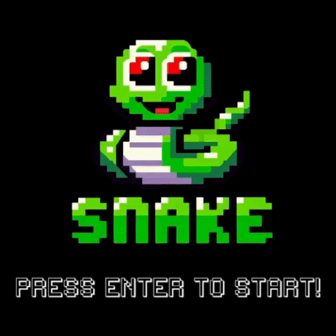

# Snake Game


## Introduction
PacSnake is a basic variation of the classic Snake game, developed in C++ with SFML. This project was created to learn basic game development and to become familiar with the SFML library.

## Level Loading Method
The `loadLevel` method in the `Level` class allows for dynamic level creation based on image files. This method loads an image where each pixel's color represents a different type of level object (e.g., walls, empty spaces). This approach makes it straightforward to design new levels by simply creating images with the desired layout, making the game easily expandable with more levels.

```cpp
void Level::loadLevel(const std::string& name) {
    sf::Image levelData;
    if (!levelData.loadFromFile(name)) {
        throw std::runtime_error("Could not load the level");
    }

    auto m_levelSize = levelData.getSize();

    // Interpret each pixel color as a level object
    for (int y = 0; y < m_levelSize.y; y++) {
        for (int x = 0; x < m_levelSize.x; x++) {
            sf::Color cellData = levelData.getPixel(x, y);

            // Assign objects based on color
            // ...
        }
    }

    // Create and render level objects based on the interpreted data
    // ...
}
```

## Key Features
- Classic Snake gameplay.
- Developed with C++ and SFML.
- Simple and easy to play.

## Setup
1. Install SFML on your system.
2. Clone or download the project repository.
3. Compile the project using CMake.
4. Run the executable to start the game.

## Playing the Game
- Use arrow keys to control the snake.
- Eat food to grow in size.
- Avoid hitting the walls or the snake's own body.
